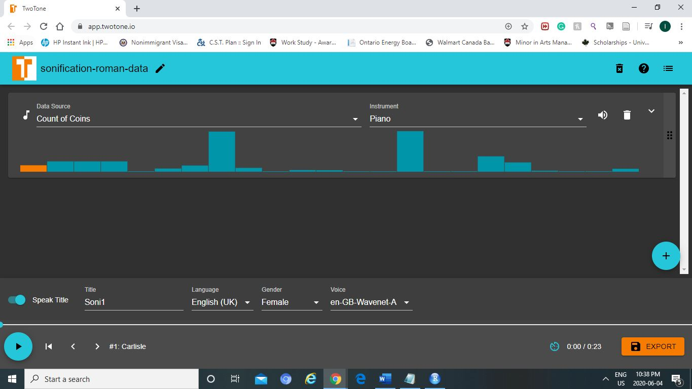
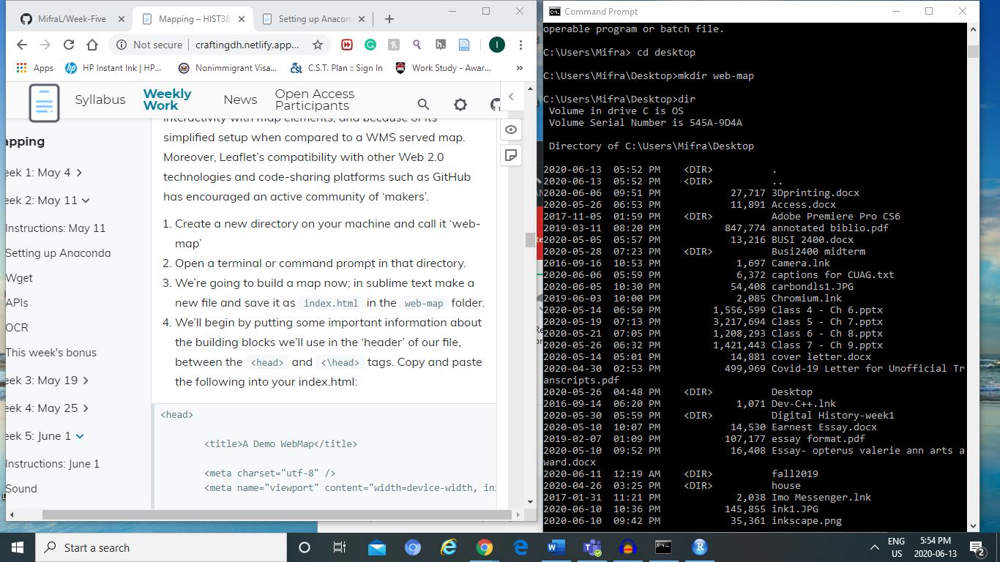
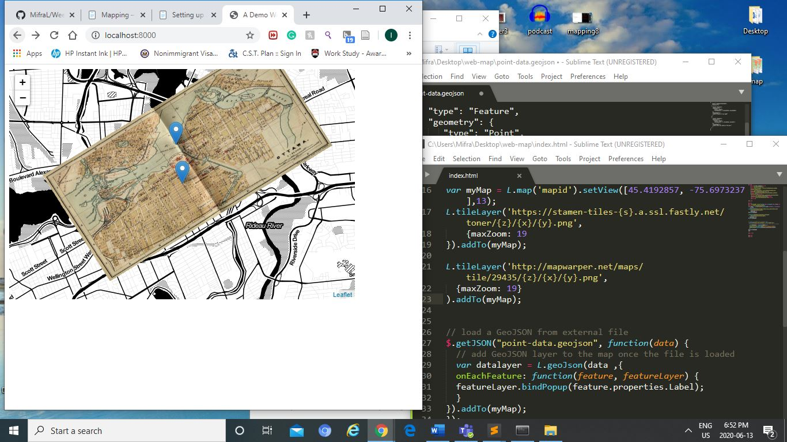

Sound 

1. Podcasting

- I live using audacity, it was easier to use then I expected.
- I just don't like how my voice sounds... 

https://drive.google.com/file/d/194KKfUvt-hEXxcvSEO-Z2HU7WSTVmxqC/view?usp=sharing

2. Sonification 

-	I switched to the weather report one to see and the sound went up as the graph went up. I believe rather than it being music, it more like patterns that could be identified using sound. 
-	Even when I change the instrument, the notes can be recognized …. It influence the feel, the piono feel softer compared to the mandolin 

Mapping 

-	Had a trouble with setting up the web-map into a directory, but it worked finally when I used anaconda prompt.
-	Then I though, I made a mistake with my map as it was missing the overlapping map but it was because I was not there yet.  

StoryMap

https://uploads.knightlab.com/storymapjs/eb71e3ba28cfb9dd2921a238e08bf84b/story/index.html

<iframe src="https://uploads.knightlab.com/storymapjs/eb71e3ba28cfb9dd2921a238e08bf84b/story/index.html" frameborder="0" width="100%" height="800"></iframe>

http://mapwarper.net/maps/tile/48160/{z}/{x}/{y}.png

- It was a great tool. I had a bit of trouble getting it to flow and finding a topic that would make sense. 
- I had changed the title but it was not shown... even when I saved and published the changes 
- So I copied the storymap and renamed it and it worked.

https://uploads.knightlab.com/storymapjs/eb71e3ba28cfb9dd2921a238e08bf84b/shows-i-loved/index.html

<iframe src="https://uploads.knightlab.com/storymapjs/eb71e3ba28cfb9dd2921a238e08bf84b/shows-i-loved/index.html" frameborder="0" width="100%" height="800"></iframe>

Poster 

- I had an issue trying to do the poster with my essay using the template because it kept moving when I tried to select my texts
- Other than that, it was fairly easy to use 

Static Websites

- It was nice and simple. I like it. 
